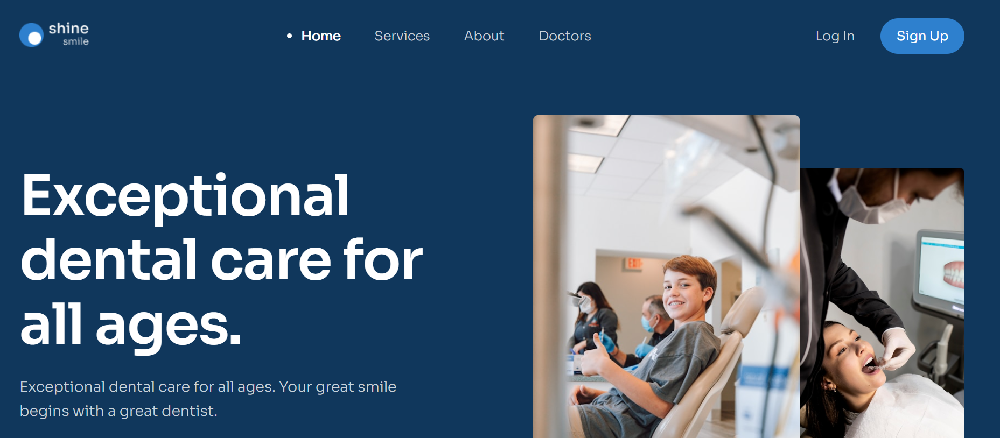
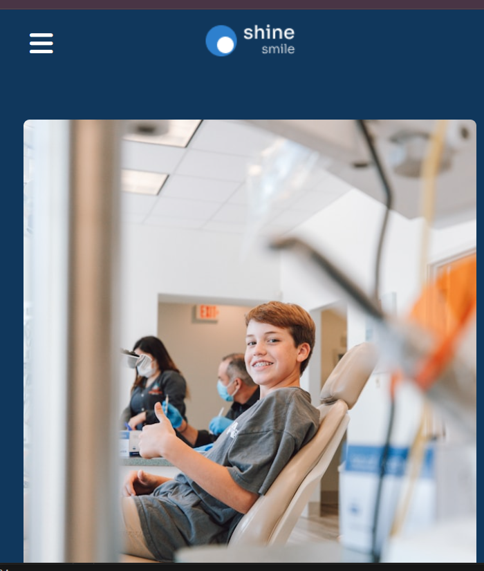

# 📚 The Shine Smile

This is a personal website built with HTML, CSS, and JavaScript, showcasing my Frontend skills and documenting my amazing projects on my journey to becoming a Frontend Developer.🚀
# My Website on:
| PC | Mobile |
|------------|------------|
|  |  |
## 🎯 Goal: 
- Demonstrate my **HTML, CSS, JavaScript** skills through a beautiful and smooth interface.

## ✨ Key Features:
- 📱 **Responsive**: Looks great on both desktop and mobile devices.
- 💡**Animation**: Show web interface when scrolling down page
## 🛠 Technologies Used
-  **HTML/CSS**, **JavaScript (ES6)**, **AOS**:
## 📖 Installation
1. **Clone the repository**:
   ```bash
   git clone https://github.com/vannhac/Shine-Smile-Website.git
   ```
2. **Navigate to the project folder**:
   ```bash
   cd Shine-Smile-Website
   ```
3. **Open the CV**:
   - Open `index.html` in a browser to view the website.
   - Alternatively, deploy to GitHub Pages or a web server.

---
